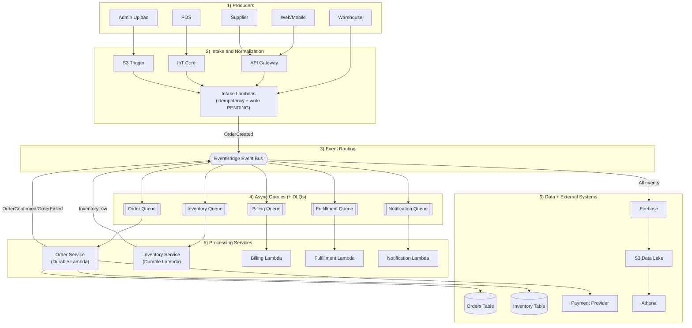
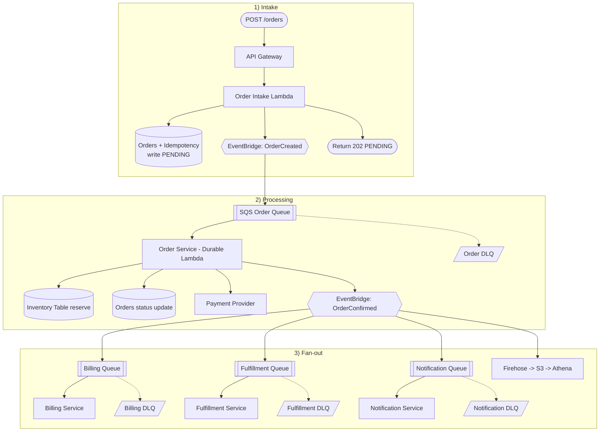
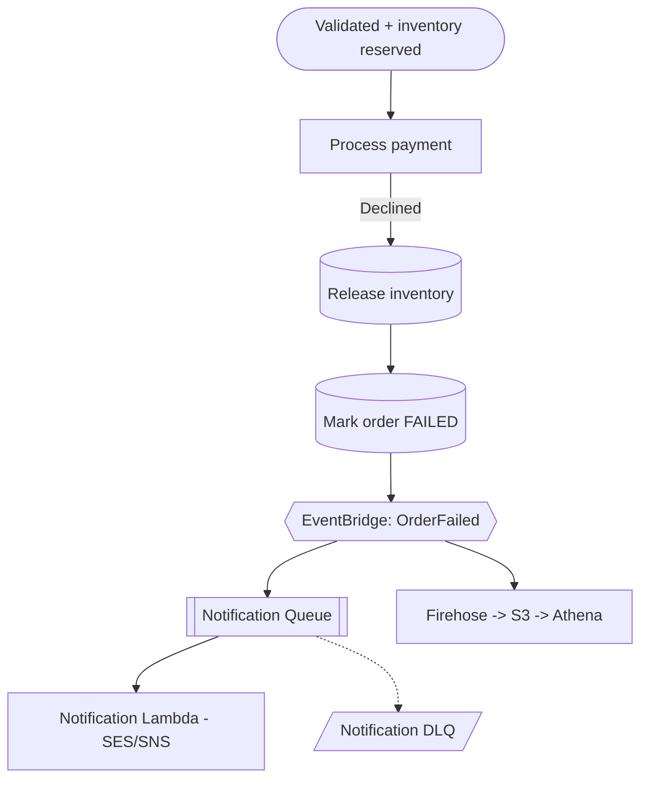

# Event-Driven Inventory & Order Processing System

### Architecture Design Document

**Author:** Elephant Team
**Date:** March 2026
**Course:** CSEP 590B — Cloud Computing Architecture
**Project:** Project 2 — Architecture Design Document

---

## Table of Contents

- [a. Executive Summary](#a-executive-summary)
- [b. High-Level Architecture](#b-high-level-architecture)
- [c. Well-Architected Framework Analysis](#c-well-architected-framework-analysis)
- [d. Cloud Design Patterns](#d-cloud-design-patterns)
- [e. Data Management Strategy](#e-data-management-strategy)
- [f. Reliability & Resilience](#f-reliability--resilience)
- [g. Cost & Performance Model](#g-cost--performance-model)
- [h. Security Model](#h-security-model)
- [i. Operations & Observability](#i-operations--observability)

---

## a. Executive Summary

### Business Context

A mid-size retailer processes orders across five channels — web storefront, mobile application, point-of-sale terminals, warehouse scanners, and supplier webhooks. Each channel generates events that must flow through a unified order processing pipeline with real-time inventory tracking. The current system suffers from overselling during peak demand, inconsistent inventory counts across channels, and a lack of operational visibility into order processing health.

### Business Goals

The system must deliver on five core capabilities:

1. **Unified order processing** — A single pipeline ingests orders from all five channels, validates stock, and progresses each order through a defined lifecycle (PENDING → VALIDATING → RESERVED → PROCESSING → CONFIRMED or FAILED).
2. **Real-time inventory accuracy** — Inventory counts update atomically at the moment of reservation, eliminating overselling regardless of concurrent demand.
3. **Sub-second acknowledgment** — Clients receive an order ID and PENDING status within milliseconds. Processing continues asynchronously.
4. **Analytics and forecasting** — Every event flows into an immutable event log for trend analysis, revenue reporting, failure rate tracking, and inventory turnover dashboards.
5. **Automated notifications** — Customers receive email confirmations and failure notices. Operations teams receive SMS alerts for low inventory and system health issues.

### Success Criteria

| Metric                             | Target                           | Measurement                                          |
| ---------------------------------- | -------------------------------- | ---------------------------------------------------- |
| Order acknowledgment latency (P99) | < 500 ms                         | Per-channel ingestion round-trip (API GW for web/mobile/supplier, IoT Core for POS, direct SDK for warehouse, S3 trigger for admin) |
| Overselling incidents              | Zero                             | Conditional DynamoDB writes enforce stock ≥ quantity |
| System availability                | 99.95%                           | Measured across all ingestion points (API Gateway, IoT Core, S3) monthly                    |
| Spike absorption                   | 10,000 orders/min                | SQS queue depth stays bounded; no dropped orders     |
| Analytics freshness                | < 60 seconds                     | Firehose delivery interval to S3                     |
| Notification delivery              | < 30 seconds after status change | CloudWatch custom metric on SES/SNS delivery         |

### Constraints

- **AWS-only** — All services must run on AWS. No third-party infrastructure beyond the external payment provider.
- **Serverless-first** — Prefer managed services with no server provisioning. Lambda, DynamoDB on-demand, EventBridge, SQS, and Firehose are the primary compute and integration primitives.
- **At-least-once processing** — The system assumes messages may be delivered more than once. Every write operation must be idempotent.
- **Budget-conscious** — Pay-per-use pricing with zero idle cost. No reserved capacity or always-on compute.

### Key Risks

| Risk                                                  | Likelihood | Impact                                       | Mitigation                                                                                   |
| ----------------------------------------------------- | ---------- | -------------------------------------------- | -------------------------------------------------------------------------------------------- |
| DynamoDB hot partitions on popular products           | Medium     | High — throttled writes cause order failures | Distribute writes across partition keys; DynamoDB adaptive capacity handles moderate skew    |
| Payment provider outage                               | Medium     | High — orders stuck in PROCESSING            | Circuit breaker fails fast; SQS retries with backoff; Durable Lambda replays from checkpoint |
| Lambda cold starts on spike arrival                   | Medium     | Low — adds ~1s to first invocations          | Provisioned concurrency on Order Service; SQS absorbs during ramp-up                         |
| EventBridge throughput limit (10K events/sec default) | Low        | Medium — events queued at source             | Request quota increase before peak season; all ingestion Lambdas and IoT Core rules have retry logic on PutEvents        |
| Duplicate event delivery                              | High       | Low — by design                              | Idempotency at 3 layers: front-door key, Durable Lambda checkpoints, conditional DDB writes  |

---

## b. High-Level Architecture

### System Layers

For this document, the **Data Flow Diagram** below is the primary architecture view. It already captures all six logical layers clearly: **Ingestion** → **Event Bus** → **Processing** → **Data** → **Analytics** → **Notification**, without forcing compressed component boxes.

### Data Flow Diagram

One-page vertical view of end-to-end flow:



### Happy Path — Order Placed to Confirmed (Web/Mobile Channel)

> This diagram shows the web/mobile path — the most common channel. POS orders follow the same
> post-EventBridge flow but enter via IoT Core → POS Intake Lambda → EventBridge. Warehouse
> scanners embed intake logic and call PutEvents directly. Supplier webhooks use API Gateway →
> Webhook Intake Lambda. Admin uploads use S3 → Admin Ingest Lambda. All intake Lambdas perform
> idempotency checks and write PENDING before emitting to EventBridge. Processing from
> EventBridge onward is identical for all channels.



### Failure Path — Payment Rejected



### Technology Choices

| Decision               | Chosen                                 | Alternative                    | Rationale                                                                                                                                                                                                                                                                                        |
| ---------------------- | -------------------------------------- | ------------------------------ | ------------------------------------------------------------------------------------------------------------------------------------------------------------------------------------------------------------------------------------------------------------------------------------------------ |
| Event bus              | **EventBridge**                        | SNS + SQS fan-out              | EventBridge offers content-based filtering, schema registry, event archive/replay, and native DLQ per rule target. SNS fan-out requires managing separate SQS subscriptions and lacks built-in replay.                                                                                           |
| Compute                | **Lambda** (serverless)                | ECS Fargate                    | Lambda provides zero idle cost, automatic scaling, and per-invocation billing. ECS Fargate would require minimum task counts and container management for a workload that is inherently event-triggered.                                                                                         |
| Operational data store | **DynamoDB** (on-demand)               | Aurora Serverless v2           | DynamoDB offers single-digit millisecond latency, conditional writes for inventory atomicity, and true pay-per-request pricing with no minimum capacity. Aurora adds connection pooling complexity and cold-start delays.                                                                        |
| Saga orchestration     | **Durable Lambda** (checkpoint/replay) | Step Functions                 | Durable Lambda keeps saga logic in application code (Python), allows fine-grained exception handling with compensation in `except` blocks, and avoids the Step Functions state machine definition overhead. Step Functions would add a per-transition cost and an additional service to monitor. |
| Saga orchestration     | **Durable Lambda**                     | Pure choreography              | Choreography across 6+ Lambdas creates distributed compensation chains that are difficult to reason about and debug. Durable Lambda centralizes the order lifecycle in one function with explicit checkpoints.                                                                                   |
| Analytics              | **Firehose + S3 + Athena**             | Amazon Redshift                | Firehose + Athena is serverless and pay-per-query ($5/TB scanned). Redshift requires provisioned clusters with hourly billing — disproportionate cost for a workload that runs ad-hoc analytical queries, not continuous BI dashboards.                                                          |
| Notifications          | **SES (email) + SNS (SMS)**            | Third-party (SendGrid, Twilio) | SES and SNS are native AWS services with IAM integration, pay-per-message pricing, and no external API dependency. Third-party services would introduce additional secrets management and network calls.                                                                                         |
| POS ingestion          | **IoT Core → POS Intake Lambda**       | API Gateway                    | IoT Core supports MQTT with X.509 device certificate authentication, built-in offline message buffering, and device registry management. IoT Core rule invokes POS Intake Lambda to normalize the MQTT payload, check idempotency, and write PENDING before emitting OrderCreated. API Gateway would require custom auth and lacks native support for intermittent device connectivity. |
| Admin bulk upload      | **S3 + Lambda trigger**                | API Gateway                    | S3 handles large file uploads (CSV, JSON) natively with multipart upload, and Lambda triggers process asynchronously. API Gateway has a 10MB payload limit and 29-second timeout, making it unsuitable for bulk imports that may contain thousands of records.                                   |
| Warehouse ingestion    | **Direct PutEvents (IAM)**             | API Gateway                    | Warehouse scanners are internal services with IAM roles. Direct PutEvents eliminates HTTP overhead and API Gateway costs. SigV4 signing provides strong authentication without managing API keys.                                                                                                |

---

## c. Well-Architected Framework Analysis

### Operational Excellence

**Operations as code.** All infrastructure is defined in AWS CDK (TypeScript) — EventBridge rules, IoT Core rules and device provisioning templates, Lambda functions, DynamoDB tables, SQS queues, S3 bucket event configurations, and IAM roles are version-controlled and deployed via CI/CD. `cdk deploy` recreates the entire stack with no manual console configuration.

**Small, reversible changes.** Each service deploys independently. Adding a new consumer (e.g., loyalty points) requires only a new EventBridge rule, SQS queue, DLQ, and Lambda — zero changes to existing services.

**Observability.** Structured JSON logs include `orderId`, `customerId`, `eventType`, and `service` in every log line. CloudWatch Logs Insights enables cross-service queries. All events stream to S3 via Firehose for post-incident analysis with Athena.

**Anticipate failure.** Every EventBridge rule delivers to an SQS queue (not directly to Lambda), providing spike buffering and retry isolation. Each of the five consumer SQS queues has a dedicated DLQ (maxReceiveCount: 3). CloudWatch alarms on DLQ depth > 0, queue age > 5 minutes, and failure rate > 5%. Runbooks define triage procedures (see [Section i](#i-operations--observability)).

### Security

**Strong identity foundation.** Each Lambda has its own IAM role scoped to specific DynamoDB table ARNs and actions — no wildcard (`*`) permissions. See [Section h](#h-security-model) for the full IAM matrix.

**Traceability.** X-Ray traces every request end-to-end across API Gateway, IoT Core, Lambda, DynamoDB, and EventBridge. CloudTrail logs all API calls.

**Defense in depth.** API Gateway validates request schemas and enforces throttling. WAF blocks common attack patterns. IoT Core authenticates POS terminals via X.509 device certificates. Warehouse scanners use IAM-authenticated direct PutEvents with SigV4 signing. S3 bucket policies restrict admin uploads to authorized IAM users with MFA. DynamoDB encrypts at rest (KMS). All data in transit uses TLS 1.2+. PII fields use application-level encryption with a customer-managed CMK — only the Notification Service can decrypt.

**Keep people away from data.** No SSH, no bastion hosts. All operations happen through IAM-authenticated API calls, CDK deployments, and CloudWatch dashboards.

### Reliability

**Automatic recovery.** SQS retries with backoff (3 attempts). Durable Lambda replays from the last checkpoint, skipping completed steps. DLQs capture messages that exhaust retries. Example: payment timeout at step 3 → SQS redelivers → Durable Lambda skips steps 1-2 → retries step 3.

**Tested recovery.** Five chaos scenarios validate the system's resilience — see [Section f](#f-reliability--resilience).

**Horizontal scaling.** Every service scales independently. SQS absorbs spikes, DynamoDB on-demand auto-scales, and reserved Lambda concurrency per service prevents cascade failures.

**Automated change management.** EventBridge rules are declarative — add consumers without modifying producers. DynamoDB PITR enables point-in-time recovery to any second in the last 35 days.

### Performance Efficiency

**Managed services eliminate capacity planning.** DynamoDB on-demand, Lambda auto-scaling, EventBridge unlimited throughput (within quota), and Firehose auto-buffering. No performance tuning required.

**Serverless everywhere.** Zero servers to manage. All 12 AWS services used (API Gateway, Lambda, DynamoDB, EventBridge, SQS, Firehose, S3, Athena, SES, SNS, IoT Core, Cognito) are fully managed.

**Easy experimentation.** New consumers can be added with a single EventBridge rule and Lambda function. Testing a "fraud detection" consumer: deploy Lambda, create EB rule, observe results — zero risk to production.

**Global readiness.** DynamoDB Global Tables and S3 cross-region replication support regional DR. All compute is re-deployable via CDK.

### Cost Optimization

**Pay-per-use everywhere.** Zero idle cost — when no orders flow, every component bills $0. DynamoDB on-demand scales with request volume. Lambda charges per 1ms of execution.

**Cost efficiency.** The design targets low per-order cost through serverless, event-driven processing and no always-on compute (see [Section g](#g-cost--performance-model)).

**No undifferentiated heavy lifting.** No EC2, ECS, RDS, or Elasticsearch. Every component is a managed service with automatic patching, scaling, and availability. Infrastructure management cost: zero.

**Attribution.** AWS Cost Allocation tags on every resource (`Service`, `Environment`, `CostCenter`) enable per-component cost visibility.

### Sustainability

**Compute only on events.** All compute runs on AWS's shared Lambda fleet — no dedicated servers with idle capacity. Lambda executes only when events arrive.

**Automatic cleanup.** DynamoDB TTL deletes expired idempotency records after 24 hours. S3 lifecycle policies transition data: Standard → Infrequent Access (30d) → Glacier (90d).

**Batched writes.** Firehose buffers events (60s or 1MB) before writing to S3, reducing API calls ~100x compared to per-event writes.

---

## d. Cloud Design Patterns

Seven patterns address reliability, scalability, and operational requirements. Each is described with its problem context, application, and implementing components.

### 1. Saga Pattern (Orchestration)

**Problem:** An order spans multiple operations (validation, inventory reservation, payment, confirmation) that must either all succeed or be compensated. Traditional distributed transactions don't work across DynamoDB, an external payment provider, and EventBridge.

**Application:** The Order Service uses Durable Lambda with `ctx.step()` checkpoints to implement an orchestrated saga. Each step is recorded to a durable store. If the Lambda is interrupted or fails, SQS redelivers the message and Durable Lambda replays from the last successful checkpoint, skipping completed steps.

Compensation is explicit in `except` blocks:

```python
@durable
def handler(event, ctx):
    order = event["detail"]
    try:
        ctx.step(validate_order, order)
        ctx.step(reserve_inventory, order)       # checkpoint
        ctx.step(process_payment, order)          # checkpoint
        ctx.step(confirm_order, order)            # checkpoint
        ctx.step(emit_event, "OrderConfirmed", order)
    except PaymentError:
        ctx.step(release_inventory, order)        # compensate
        ctx.step(mark_failed, order, "PAYMENT_FAILED")
        ctx.step(emit_event, "OrderFailed", order)
    except InventoryError:
        ctx.step(mark_failed, order, "OUT_OF_STOCK")
        ctx.step(emit_event, "OrderFailed", order)
```

**Components:** Order Service (Durable Lambda), SQS Order Queue, DynamoDB Orders and Inventory tables.

### 2. Queue-Based Load Leveling

**Problem:** Holiday traffic spikes can reach 100x normal volume (10,000 orders/min vs. 100 orders/min). Without buffering, downstream services would be overwhelmed, causing throttling, timeouts, and dropped orders.

**Application:** An SQS queue sits between EventBridge and the Order Service. EventBridge delivers OrderCreated events to SQS at any rate. SQS has unlimited queue depth and absorbs the entire spike. The Order Service Lambda has reserved concurrency (e.g., 200 concurrent executions), processing messages at a controlled rate. The queue drains naturally once the spike subsides.

```
Normal:    100 orders/min → SQS depth ≈ 0 → instant processing
Holiday: 10,000 orders/min → SQS depth grows → Lambda at max concurrency → queue drains over minutes
```

The Inventory Service uses the same pattern with a separate SQS queue for inventory adjustment events (InventoryReceived, InventoryAdjusted, ReturnInitiated).

**Components:** SQS Order Queue, SQS Inventory Queue, EventBridge rules, Lambda reserved concurrency.

### 3. Event Sourcing

**Problem:** The system needs an audit trail of every state change for analytics, debugging, compliance, and potential event replay. Storing only the current state in DynamoDB loses the history of how the system reached that state.

**Application:** Every event emitted to EventBridge is routed to Kinesis Data Firehose via an "all events" rule. Firehose batches events and delivers them to S3 as immutable, append-only Parquet files partitioned by date and event type. This log serves three purposes:

- **Analytics:** Athena queries for order trends, revenue analysis, and failure rate reporting.
- **Audit:** Every event includes `orderId`, `timestamp`, `eventType`, and the full payload.
- **Replay:** EventBridge Archive stores events for a configurable retention period. Archived events can be replayed to populate a new consumer's initial state.

**Components:** EventBridge "route-all-to-analytics" rule, Kinesis Data Firehose, S3 data lake, Athena, EventBridge Archive.

### 4. CQRS (Command Query Responsibility Segregation)

**Problem:** Writes (placing orders, reserving inventory) and reads (checking order status) have different scaling and consistency requirements. Coupling them forces trade-offs that compromise both.

**Application:** Write and read paths are completely separated:

- **Write path:** Client → API Gateway → Intake Lambda → DynamoDB + EventBridge → SQS → Order Service → DynamoDB + EventBridge.
- **Read path:** Client → API Gateway → DynamoDB (direct integration, no Lambda). Single-digit millisecond latency, zero Lambda invocations.

During a 10,000 orders/min spike, read latency remains unchanged — no shared compute with the write path.

**Components:** API Gateway (write + read endpoints), Intake Lambda (write only), DynamoDB direct integration (read only).

### 5. Retry with Exponential Backoff

**Problem:** Transient failures (network timeouts, throttling, cold starts) are inevitable. Immediate retry without backoff compounds the problem.

**Application:** Retry with backoff at three layers:

1. **SQS retry:** Failed messages return to the queue with increasing visibility timeout (3 attempts max, then DLQ).
2. **Durable Lambda replay:** On Lambda interruption, SQS redelivers and Durable Lambda replays from the last checkpoint — skipping completed steps like payment charges.
3. **Payment idempotency:** `orderId` is the payment provider's idempotency key. Retries return the original result, never double-charge.

**Components:** SQS retry policies, Durable Lambda checkpoints, payment provider idempotency keys.

### 6. Bulkhead Pattern

**Problem:** A slow payment provider could cause Order Service to consume all Lambda concurrency, starving other services of compute.

**Application:** Each service has reserved Lambda concurrency, creating isolated failure domains:

| Service              | Reserved Concurrency | Queue                   | DLQ                     |
| -------------------- | -------------------- | ----------------------- | ----------------------- |
| Order Service        | 200                  | SQS Order Queue         | Order DLQ               |
| Inventory Service    | 100                  | SQS Inventory Queue     | Inventory DLQ           |
| Billing Service      | 50                   | SQS Billing Queue       | Billing DLQ             |
| Fulfillment Service  | 50                   | SQS Fulfillment Queue   | Fulfillment DLQ         |
| Notification Service | 100                  | SQS Notification Queue  | Notification DLQ        |

Every consumer receives events through its own SQS queue — not directly from EventBridge. This provides spike buffering, retry isolation, and a per-service DLQ (maxReceiveCount: 3). If the payment provider slows down, Order Service consumes up to 200 executions — but other services continue normally with their own pools. Failed messages land in the per-service DLQ for inspection and redrive.

**Components:** Lambda reserved concurrency per service, SQS queue per consumer, DLQ per queue.

### 7. Circuit Breaker

**Problem:** The external payment provider is the one dependency outside our control. If it goes down, continuing to send requests wastes Lambda execution time and compounds the provider's recovery.

**Application:** The Order Service implements a circuit breaker:

- **Closed (normal):** Payment calls proceed. Failures are counted.
- **Open (tripped):** After 5 consecutive failures or > 50% failure rate over 1 minute, the circuit opens. Subsequent calls fail immediately — Durable Lambda releases inventory, marks FAILED, and emits OrderFailed.
- **Half-open (testing):** After 30 seconds, one test request is allowed. Success closes the circuit; failure keeps it open.

Circuit state is stored in DynamoDB (`provider`, `state`, `failCount`, `lastFailure`) so all concurrent Lambda instances share it.

**Components:** Order Service Lambda, DynamoDB circuit breaker state item, payment provider API.

---

## e. Data Management Strategy

### Consistency Model

The system applies strong consistency where correctness demands it and eventual consistency where availability matters more.

| Data                      | Consistency  | Rationale                                                                                                                   |
| ------------------------- | ------------ | --------------------------------------------------------------------------------------------------------------------------- |
| Inventory stock counts    | **Strong**   | Conditional writes execute atomically — the condition IS the check. Zero overselling.                                       |
| Idempotency keys          | **Strong**   | `attribute_not_exists` condition rejects duplicates atomically.                                                             |
| Order status (write path) | **Strong**   | `UpdateItem` is strongly consistent. Saga always reads latest status.                                                       |
| Order status (read path)  | **Eventual** | API GW direct integration uses eventually consistent reads. Clients poll after receiving 202, so < 100ms lag is acceptable. |
| Cross-service state       | **Eventual** | Downstream services receive changes through EventBridge events. Decoupling requires eventual consistency by design.         |

### Storage Architecture

**DynamoDB — Orders Table** (operational)

- _Schema:_ PK: `customerId`, SK: `orderId`. GSI1: `orderId` (lookup by ID). GSI2: `status` + `createdAt` (status queries).
- _Write:_ PutItem (Intake Lambda), UpdateItem (Order Service)
- _Read:_ GetItem by orderId (API GW direct integration)

**DynamoDB — Inventory Table** (operational)

- _Schema:_ PK: `productId`. Attributes: `stockCount`, `lowStockThreshold`.
- _Write:_ UpdateItem with conditional expression (Order Service, Inventory Service)
- _Read:_ GetItem by productId (Order Service validation)

**DynamoDB — Idempotency Table** (operational)

- _Schema:_ PK: `idempKey`. Attributes: `orderId`, `ttl` (24h epoch).
- _Write:_ PutItem with `attribute_not_exists` condition (all intake Lambdas: Order Intake, POS Intake, Webhook Intake, Admin Ingest; warehouse scanner app performs the same check directly)
- _Cleanup:_ TTL auto-deletes after 24 hours

**S3 Data Lake** (analytical)

- _Schema:_ Parquet files partitioned by `year/month/day/eventType/`
- _Write:_ Firehose delivery (batched, 60s or 1MB buffer)
- _Read:_ Athena SQL queries via Glue Data Catalog. $5/TB scanned, reduced with Parquet columnar format and partitioning.

### Replication & Durability

| Service         | Durability                                                                | Backup                                                                    |
| --------------- | ------------------------------------------------------------------------- | ------------------------------------------------------------------------- |
| **DynamoDB**    | 3-AZ replication (default). Optional Global Tables for multi-region DR.   | PITR on Orders and Inventory — restore to any second in the last 35 days. |
| **S3**          | 11 nines durability. 3-AZ replication. Optional cross-region replication. | Versioning enabled. Lifecycle: Standard → IA (30d) → Glacier (90d).       |
| **SQS**         | Multi-AZ replication. 4-day retention (configurable to 14 days).          | Transient by nature. DLQ messages retained 14 days.                       |
| **EventBridge** | Multi-AZ. At-least-once delivery to each target.                          | Archive with 90-day retention for event replay.                           |

### Disaster Recovery

Active-passive DR configuration:

- **DynamoDB Global Tables** — Orders and Inventory replicated to a secondary region (sub-second lag)
- **S3 Cross-Region Replication** — Analytics data lake copied to secondary region
- **CDK deployment** — Compute layer (Lambda, API GW, EventBridge, SQS) re-deployable to any region
- **RPO:** Near-zero. **RTO:** < 1 hour (regional failover), < 5 minutes (single-service recovery).

---

## f. Reliability & Resilience

### Failure Mode Analysis

**Payment provider down**

- _Detection:_ Circuit breaker trips after 5 consecutive failures; CloudWatch alarm on OrderFailed rate > 20%
- _Impact:_ Orders cannot complete payment
- _Recovery:_ Circuit breaker fails fast. Durable Lambda releases inventory and marks FAILED. On-call investigates provider status; DLQ redrive after recovery.

**DynamoDB throttling**

- _Detection:_ CloudWatch `ThrottledRequests` > 0; X-Ray shows elevated latency
- _Impact:_ Write operations slow or fail, causing order processing delays
- _Recovery:_ DynamoDB on-demand auto-scales within minutes. SQS absorbs backlog during ramp-up. If sustained, investigate hot partition keys.

**Lambda cold starts**

- _Detection:_ CloudWatch `Init Duration` metric; P99 latency spike at traffic increase
- _Impact:_ First invocations add ~1s latency
- _Recovery:_ Provisioned concurrency on Order Service eliminates cold starts on the critical path. SQS absorbs messages during ramp-up.

**EventBridge delivery failure**

- _Detection:_ `FailedInvocations` metric; DLQ depth increases
- _Impact:_ Downstream actions (billing, notification) delayed — order processing itself is unaffected
- _Recovery:_ EventBridge retries for 24 hours with backoff. Failed events land in per-target DLQ. Redrive after target recovers.

**Poison message**

- _Detection:_ SQS message visibility stays constant; DLQ receives messages
- _Impact:_ One malformed message blocks that single order
- _Recovery:_ SQS maxReceiveCount (3) moves poison messages to DLQ automatically. Other messages continue normally. Inspect, fix, and redrive.

**Duplicate event delivery**

- _Detection:_ Idempotency check hits in DynamoDB; Durable Lambda checkpoint shows step completed
- _Impact:_ None — duplicates handled at all layers
- _Recovery:_ Automatic. Idempotency table rejects duplicates. Durable Lambda skips completed steps. Conditional DDB writes prevent double-counting.

**IoT Core disconnection (POS terminals)**

- _Detection:_ IoT Core `Connect.Success` metric drops; CloudWatch alarm on connected device count below threshold
- _Impact:_ POS orders buffered on the device. Events delayed until reconnection.
- _Recovery:_ Automatic. IoT Core's persistent sessions retain subscriptions and queue messages (QoS 1) for up to 1 hour. When the POS terminal reconnects, buffered messages are delivered to the POS Intake Lambda via IoT Core rules, normalized, and emitted to EventBridge. If disconnection exceeds the session expiry, the POS application's local queue replays events on reconnection.

**Admin upload — malformed file**

- _Detection:_ Admin Ingest Lambda logs parsing errors; CloudWatch alarm on Lambda error rate
- _Impact:_ Malformed CSV/JSON file fails to produce events. No partial ingestion — Lambda rejects the entire file.
- _Recovery:_ Lambda writes the file to an error prefix in S3 (`uploads/errors/`) with a parsing report. Admin is notified via SNS. Fix file and re-upload.

**Availability Zone failure**

- _Detection:_ AWS Health Dashboard; CloudWatch anomaly detection
- _Impact:_ Requests routed to failed AZ experience transient errors
- _Recovery:_ Automatic. All services are multi-AZ by default. AWS routes traffic to healthy AZs. No manual intervention required.

### Chaos Scenarios

These scenarios should be executed in staging before production deployment.

**Scenario 1: Kill Lambda Mid-Saga**

- **Setup:** Process an order. After `reserve_inventory` completes but before `process_payment` starts, terminate the Lambda execution (set timeout to 5 seconds, inject a 10-second sleep before payment).
- **Expected outcome:** SQS redelivers the message. Durable Lambda replays: skips `validate_order` and `reserve_inventory` (already checkpointed), retries `process_payment`. Order eventually reaches CONFIRMED. Inventory is not double-reserved.
- **Validates:** Durable Lambda checkpoint/replay, SQS retry, idempotent inventory operations.

**Scenario 2: 10x Load Spike**

- **Setup:** Send 1,000 orders/min for 10 minutes (10x normal volume).
- **Expected outcome:** SQS queue depth increases. Lambda processes at reserved concurrency. Queue drains within 15 minutes after spike ends. Zero dropped orders. All orders reach terminal state (CONFIRMED or FAILED). P99 acknowledgment latency remains < 500ms (Intake Lambda is unaffected by processing backlog).
- **Validates:** Queue-based load leveling, Lambda concurrency controls, DynamoDB auto-scaling.

**Scenario 3: Block EventBridge Target**

- **Setup:** Remove IAM permission for EventBridge to send messages to the Notification SQS queue. Process 10 orders.
- **Expected outcome:** Orders process normally (CONFIRMED). Notification events fail delivery to SQS and EventBridge retries with backoff for 24 hours. Billing and Fulfillment queues are unaffected. DLQ alarm triggers. After restoring IAM permission, events flow to the Notification SQS queue and are processed normally.
- **Validates:** Bulkhead isolation via per-service SQS queues, EventBridge retry behavior, independent consumer health.

**Scenario 4: Overselling Pressure**

- **Setup:** Set product X stock to 5. Submit 20 concurrent orders for product X, each requesting quantity 1.
- **Expected outcome:** Exactly 5 orders reach CONFIRMED with inventory reserved. Remaining 15 orders fail with `OUT_OF_STOCK`. Final stock count is 0. No negative stock counts.
- **Validates:** DynamoDB conditional writes, atomic inventory operations, saga compensation.

**Scenario 5: POS Device Goes Offline**

- **Setup:** Disconnect a POS terminal from the network (drop MQTT connection) while it has 5 pending orders queued locally. Wait 2 minutes, then reconnect.
- **Expected outcome:** IoT Core detects the disconnection. During the offline period, the POS application queues orders locally. On reconnection, IoT Core's persistent session delivers any QoS 1 messages to the POS Intake Lambda, which normalizes payloads, checks idempotency, writes PENDING, and emits OrderCreated. The POS replays its local queue. All 5 orders appear in EventBridge and process to CONFIRMED. No duplicate orders (idempotency keys in the POS Intake Lambda prevent double-processing).
- **Validates:** IoT Core persistent sessions, POS Intake Lambda idempotency, POS local queue, end-to-end normalize-at-edge flow.

**Scenario 6: Payment Provider Returns 500s**

- **Setup:** Configure payment provider mock to return 500 for all requests.
- **Expected outcome:** First 5 orders attempt payment and fail. Circuit breaker opens. Subsequent orders fail immediately without calling the provider. All failed orders have inventory released and status FAILED with reason `PAYMENT_FAILED` or `PAYMENT_PROVIDER_UNAVAILABLE`. After restoring the provider, circuit enters half-open state, test request succeeds, circuit closes, and new orders process normally.
- **Validates:** Circuit breaker, saga compensation, Durable Lambda error handling.

### Recovery Strategy Classification

| Category           | Mechanism                            | Recovery Time          | Human Involvement                               |
| ------------------ | ------------------------------------ | ---------------------- | ----------------------------------------------- |
| **Automatic**      | SQS retry with backoff               | Seconds to minutes     | None                                            |
| **Automatic**      | Durable Lambda checkpoint replay     | Seconds                | None                                            |
| **Automatic**      | DynamoDB on-demand auto-scaling      | Minutes                | None                                            |
| **Automatic**      | EventBridge 24-hour retry            | Minutes to hours       | None                                            |
| **Automatic**      | Circuit breaker open/half-open/close | 30 seconds per cycle   | None                                            |
| **Semi-automatic** | DLQ redrive (SQS)                    | Minutes after approval | Operator approves redrive                       |
| **Semi-automatic** | EventBridge Archive replay           | Minutes after trigger  | Operator selects time range and target          |
| **Semi-automatic** | DynamoDB PITR restore                | Minutes to hours       | Operator specifies restore point                |
| **Manual**         | Poison message investigation         | Hours                  | Engineer inspects DLQ message, fixes root cause |
| **Manual**         | Regional failover with Global Tables | < 1 hour               | Team executes DR runbook                        |

### Recovery Objectives

| Scope                    | RPO (Recovery Point Objective)             | RTO (Recovery Time Objective)   |
| ------------------------ | ------------------------------------------ | ------------------------------- |
| Single Lambda failure    | 0 (SQS retains message)                    | Seconds (SQS redelivery)        |
| Single service outage    | 0 (events in DLQ or SQS)                   | < 5 minutes (redeploy or fix)   |
| DynamoDB data corruption | 0 (PITR continuous backup)                 | 15-30 minutes (PITR restore)    |
| Single AZ failure        | 0 (multi-AZ default)                       | 0 (automatic failover)          |
| Full region failure      | < 1 second (Global Tables replication lag) | < 1 hour (DR runbook execution) |

---

## g. Cost & Performance Model

This section intentionally uses **qualitative reasoning** rather than numeric estimates, to explain why the architecture remains cost-efficient and where costs can rise.

### Cost Model (Lightweight)

Cost is kept low mainly because the design is serverless and event-driven:

- **Compute stays efficient:** Lambda runs only when events arrive; there is no idle fleet cost.
- **Integration stays efficient:** EventBridge and SQS are managed, elastic, and avoid always-on brokers.
- **Storage stays efficient:** DynamoDB on-demand fits bursty traffic; S3 + Athena avoid provisioning analytics clusters.
- **Operations stay efficient:** managed services reduce operational overhead and platform maintenance work.

Relative cost behavior by scenario:

| Scenario | Compute | Storage/Analytics | Transfer/Notification | Overall Cost Reasoning |
| -------- | ------- | ----------------- | --------------------- | ---------------------- |
| **Low traffic** | Low | Low | Low | Mostly pay-per-use with minimal background cost |
| **Medium traffic** | Moderate | Moderate | Moderate | Costs rise with usage but remain linear and predictable |
| **High/holiday traffic** | High | High | High | Still linear scaling; notifications and external integrations become dominant drivers |

Assumptions:

- Serverless/on-demand pricing in a single AWS region.
- Notification volume scales with order volume (transactional email + limited SMS alerts).
- Costs scale approximately linearly until service quota or partition hot-spot effects appear.

### Scaling Behavior Under Load

| Load Level | Expected Behavior | User Impact |
| ---------- | ----------------- | ----------- |
| **Normal (100 orders/min)** | Near-real-time processing; minimal queue depth | Ack < 500 ms, completion in seconds |
| **Busy (1,000 orders/min)** | SQS buffers bursts; Lambda scales up; DynamoDB adapts | Slightly higher completion time |
| **Peak (10,000 orders/min)** | Queue depth grows; async pipeline drains backlog | Ack still fast, fulfillment latency increases to minutes |

### Bottleneck Analysis

| Bottleneck | Why It Becomes a Limit | Mitigation |
| ---------- | ---------------------- | ---------- |
| **Order Service Lambda concurrency** | Caps processing throughput during spikes | Pre-raise reserved concurrency before known peak windows |
| **DynamoDB hot partitions** | Popular SKUs concentrate writes on one partition key | Improve key distribution and apply adaptive/write-sharding strategy |
| **Payment provider throughput** | External dependency rate limits or degraded API | Circuit breaker + retries + fallback routing/playbook |

---

## h. Security Model

### IAM — Least Privilege

Each service has a dedicated IAM role with only required actions on explicitly scoped resources (no wildcard `*` on data resources).

| Role Group | Allowed Actions (Examples) | Resource Scope |
| ---------- | -------------------------- | -------------- |
| **Ingestion roles** (web intake, POS intake, webhook intake, admin ingest, warehouse scanner) | `events:PutEvents`, limited `dynamodb:PutItem`, `s3:GetObject` (admin ingest only) | Custom event bus ARN, Orders/Idempotency table ARNs, upload bucket ARN |
| **Order service role** | `dynamodb:GetItem/UpdateItem`, `events:PutEvents`, `secretsmanager:GetSecretValue` | Orders + Inventory table ARNs, custom event bus ARN, payment secret ARN |
| **Inventory service role** | `dynamodb:GetItem/UpdateItem`, `events:PutEvents` | Inventory table ARN, custom event bus ARN |
| **Read/downstream roles** (billing, fulfillment, API read path) | `dynamodb:GetItem` (read-only) | Orders table ARN (and required index scope) |
| **Notification role** | `ses:SendEmail`, `sns:Publish`, `kms:Decrypt` | SES identity ARN, SNS topic ARN, PII CMK ARN |

EventBridge rule targets use dedicated invoke roles, and each SQS queue/DLQ pair is restricted to its owning consumer.

### Authentication & Authorization

Each ingestion channel uses the authentication mechanism best suited to its trust boundary and operational context:

- **Web / Mobile (API Gateway):** Amazon Cognito User Pools provide JWT-based authentication. API Gateway validates JWT tokens and extracts `customerId` from claims. Customers can only query their own orders (enforced by DynamoDB partition key = customerId).
- **POS terminals (IoT Core → POS Intake Lambda):** X.509 device certificates authenticate each terminal via mutual TLS. Each POS terminal has a unique certificate provisioned through IoT Core's fleet provisioning service. IoT Core policies restrict each device to publishing on its own topic namespace. An IoT Core rule invokes the POS Intake Lambda, which normalizes the MQTT payload, performs idempotency checks, writes PENDING, and emits OrderCreated to EventBridge.
- **Warehouse scanners (direct PutEvents):** IAM role attached to the warehouse scanner application. Direct `events:PutEvents` calls use SigV4 signing — no API keys or HTTP intermediary required. The IAM role is scoped to the custom event bus ARN only.
- **Supplier webhooks (API Gateway):** API Key authentication with Usage Plans for per-supplier throttling. WAF IP-based rules restrict access to known supplier IP ranges.
- **Admin upload (S3 + Lambda):** IAM-authenticated access to the S3 upload bucket. MFA required for admin IAM users. Lambda triggers on `s3:PutObject` events. The S3 bucket policy restricts uploads to the admin IAM role only.

### Encryption

| Layer                | Mechanism                                              | Key Management                                                                                                                                       |
| -------------------- | ------------------------------------------------------ | ---------------------------------------------------------------------------------------------------------------------------------------------------- |
| **DynamoDB at rest** | AWS-managed KMS encryption (default)                   | AWS manages key rotation. No additional cost.                                                                                                        |
| **S3 at rest**       | SSE-S3 (AES-256)                                       | AWS manages keys. Zero configuration.                                                                                                                |
| **In transit**       | TLS 1.2+ enforced on all endpoints                     | API Gateway, Lambda, DynamoDB, SQS, EventBridge — all AWS endpoints enforce TLS.                                                                     |
| **PII fields**       | Application-level encryption with customer-managed CMK | Email and phone fields encrypted before DynamoDB write. Only the Notification Service has `kms:Decrypt` for this CMK. Other services see ciphertext. |
| **Payment secrets**  | AWS Secrets Manager                                    | Payment API keys stored with automatic 90-day rotation. Only the Order Service has `secretsmanager:GetSecretValue`.                                  |

### Network Security

No VPC is required — all services are AWS managed with public endpoints. This eliminates ENI provisioning delays and cold start increases from VPC-attached Lambdas.

- **WAF on API Gateway** — Rate limiting, SQL injection prevention, XSS filtering, geo-blocking.
- **Lambdas call only AWS services** (via SDK over HTTPS) and the payment provider API.
- **VPC exception:** If the payment provider requires IP whitelisting, the Order Service Lambda deploys in a VPC with a NAT Gateway for a static outbound IP.

### Secrets Management

| Secret                   | Storage         | Rotation                   | Access                                          |
| ------------------------ | --------------- | -------------------------- | ----------------------------------------------- |
| Payment API key          | Secrets Manager | Automatic, 90-day rotation | Order Service Lambda only                       |
| Cognito client secrets   | Cognito service | Managed by Cognito         | API Gateway only                                |
| API Keys (supplier)      | API Gateway     | Manual, quarterly          | API Gateway validates, not accessible to Lambda |
| IoT device certificates  | IoT Core registry | Automatic via fleet provisioning; rotated on certificate expiry | IoT Core authenticates POS terminals via mutual TLS |

---

## i. Operations & Observability

### Dashboards

**Operational Dashboard (CloudWatch)**

Real-time system health and processing metrics:

- **Orders/min** — CloudWatch custom metric published by Intake Lambda. Tracks intake rate across all channels.
- **Success/fail ratio** — Ratio of OrderConfirmed to OrderFailed events over sliding 5-minute window.
- **P50/P99 latency** — End-to-end latency from OrderCreated to OrderConfirmed, measured via custom CloudWatch metrics in the Order Service.
- **SQS queue depth** — `ApproximateNumberOfMessagesVisible` for all five consumer queues (Order, Inventory, Billing, Fulfillment, Notification). Indicates backlog per service.
- **DLQ counts** — `ApproximateNumberOfMessagesVisible` for all five per-service DLQs. Any value > 0 requires investigation.
- **Lambda concurrency** — `ConcurrentExecutions` per function. Shows how close each service is to its reserved limit.
- **DynamoDB consumed capacity** — `ConsumedReadCapacityUnits` and `ConsumedWriteCapacityUnits` per table. Identifies scaling needs.
- **IoT Core connected devices** — `Connect.Success` and `Connect.AuthError` metrics. Tracks POS terminal fleet health.
- **IoT Core message throughput** — `PublishIn.Success` and `RuleMessageThrottled` metrics. Monitors POS event ingestion rate.
- **IoT Core rule action failures** — `RuleNotFound` and `RuleActionFailure` metrics. Detects broken EventBridge delivery from POS channel.

**Business Dashboard (Athena + QuickSight or Grafana)**

Scheduled Athena queries against the S3 data lake:

- **Revenue** — Sum of order totals for OrderConfirmed events, grouped by hour/day/week.
- **Top products** — Most frequently ordered products by quantity and revenue.
- **Failure reasons** — Distribution of OrderFailed events by `failReason` (OUT_OF_STOCK, PAYMENT_FAILED, PAYMENT_PROVIDER_UNAVAILABLE).
- **Inventory turnover** — Rate of stock depletion by product category.
- **Channel distribution** — Order volume by source channel (web, mobile, POS, warehouse, supplier).

### Log Aggregation

All Lambdas emit structured JSON to CloudWatch Logs with consistent fields:

```json
{
    "timestamp": "2026-03-01T12:34:56.789Z",
    "service": "OrderService",
    "function": "order-service-handler",
    "orderId": "ord-abc123",
    "customerId": "cust-xyz789",
    "eventType": "OrderCreated",
    "step": "reserve_inventory",
    "status": "success",
    "duration_ms": 42,
    "traceId": "1-abc-def"
}
```

**Retention policy:** 30 days in CloudWatch Logs (queryable via Logs Insights), then exported to S3 for long-term retention.

**Cross-service queries** using CloudWatch Logs Insights:

```sql
-- Trace a single order across all services
fields @timestamp, service, step, status, duration_ms
| filter orderId = "ord-abc123"
| sort @timestamp asc

-- Find all failed orders in the last hour with reasons
fields @timestamp, orderId, failReason
| filter eventType = "OrderFailed" and @timestamp > ago(1h)
| stats count() by failReason
```

### Custom Metrics

| Metric                | Namespace        | Dimensions            | Source        |
| --------------------- | ---------------- | --------------------- | ------------- |
| `OrdersCreated`       | `RetailPlatform` | Channel               | Intake Lambda |
| `OrdersConfirmed`     | `RetailPlatform` | —                     | Order Service |
| `OrdersFailed`        | `RetailPlatform` | FailReason            | Order Service |
| `SagaDuration`        | `RetailPlatform` | Percentile (P50, P99) | Order Service |
| `PaymentLatency`      | `RetailPlatform` | Provider, Status      | Order Service |
| `InventoryReserved`   | `RetailPlatform` | ProductId             | Order Service |
| `CircuitBreakerState` | `RetailPlatform` | Provider              | Order Service |

### Alerting

| Alert                    | Condition                                                             | Severity | Action                                                                                            |
| ------------------------ | --------------------------------------------------------------------- | -------- | ------------------------------------------------------------------------------------------------- |
| **DLQ non-empty**        | Any of 5 service DLQs `ApproximateNumberOfMessagesVisible` > 0        | P2       | Page on-call. Identify which service DLQ. Investigate message content. Redrive after fix.         |
| **SQS queue age**        | `ApproximateAgeOfOldestMessage` > 300 seconds (5 min)                 | P2       | Page on-call. Check Lambda errors and concurrency. Investigate downstream blockage.               |
| **High failure rate**    | `OrdersFailed / (OrdersConfirmed + OrdersFailed)` > 5% over 5 minutes | P1       | Page on-call + service owner. Check payment provider status, DynamoDB throttling, Lambda errors.  |
| **Lambda errors**        | `Errors / Invocations` > 1% over 5 minutes for any function           | P2       | Page on-call. Check CloudWatch Logs for error details.                                            |
| **DynamoDB throttling**  | `ThrottledRequests` > 0 over 1 minute                                 | P3       | Notify service owner (non-urgent). DDB auto-scales. Investigate if sustained.                     |
| **API Gateway 5XX**      | `5XXError` count > 10 over 1 minute                                   | P1       | Page on-call + service owner. Check Intake Lambda health, DynamoDB availability, IAM permissions. |
| **Low inventory**        | `InventoryLow` event count > 0 (via custom metric)                    | P3       | Notify inventory team (email). Reorder workflow triggered.                                        |
| **Circuit breaker open** | `CircuitBreakerState` = OPEN                                          | P1       | Page on-call. Contact payment provider. Monitor half-open recovery.                               |
| **IoT Core rule failure** | `RuleActionFailure` > 0 over 1 minute                                | P2       | Page on-call. Check IoT Core rule configuration and EventBridge permissions. POS events buffered. |
| **Admin Ingest errors**  | Admin Ingest Lambda `Errors / Invocations` > 0 over 5 minutes         | P3       | Notify admin team. Check S3 error prefix for malformed files. Re-upload after fix.                |

### Synthetic Monitoring

CloudWatch Synthetics canaries validate end-to-end health continuously:

**Order Flow Canary (every 5 minutes):**

1. POST a test order to API Gateway with a test product and test customer ID.
2. Verify 202 response with `orderId` within 500ms.
3. Poll GET `/orders/{orderId}` every 5 seconds.
4. Verify status reaches CONFIRMED within 30 seconds.
5. If any step fails, canary alarm triggers P1 alert.

**API Health Canary (every 1 minute):**

1. GET `/orders/{known-test-orderId}` from API Gateway.
2. Verify 200 response with valid order payload within 200ms.
3. Validates the read path (API GW → DynamoDB direct integration) is operational.

Test orders use a reserved `customerId` (e.g., `CANARY-TEST`) and are excluded from business dashboards via Athena query filters.

> **POS and warehouse channels** are not covered by synthetic canaries because they use IoT Core and direct PutEvents respectively, not API Gateway HTTP endpoints. These channels are monitored via IoT Core metrics (connected devices, message throughput, rule action failures) and CloudWatch custom metrics on EventBridge event arrival rates by source channel.

### Runbooks

**Runbook: DLQ Non-Empty**

1. Identify which DLQ has messages (CloudWatch alarm details).
2. Read DLQ message contents using AWS Console or CLI (`aws sqs receive-message`).
3. Determine failure cause from message attributes and Lambda error logs.
4. Fix root cause (code bug, IAM permission, downstream service).
5. Redrive messages from DLQ to source queue (`aws sqs start-message-move-task`).
6. Monitor for successful processing.
7. Close alert after DLQ is empty.

**Runbook: High Failure Rate**

1. Check `OrdersFailed` by `FailReason` dimension in CloudWatch.
2. If `PAYMENT_FAILED` dominates: check payment provider status page. If provider is down, circuit breaker should be open — verify.
3. If `OUT_OF_STOCK` dominates: verify inventory levels in DynamoDB. Check if a flash sale is in progress.
4. If mixed or unknown: check Order Service Lambda logs for exceptions. Check DynamoDB throttling metrics.
5. If DDB throttling: wait for auto-scale (5-10 min) or manually increase provisioned capacity.
6. Document root cause and resolution in incident ticket.

**Runbook: SQS Queue Growing**

1. Check Lambda concurrency usage vs. reserved limit.
2. Check Lambda error rate — if errors are high, messages retry and re-enter the queue.
3. If Lambda is healthy but at concurrency limit: the queue is working as designed (load leveling). Monitor queue depth trend.
4. If Lambda is erroring: investigate Lambda logs. Common causes: DDB throttling, payment provider timeout, code bug.
5. If queue age exceeds 15 minutes and growing: consider temporarily increasing reserved concurrency.
6. If queue contains poison messages: check DLQ for messages that exhausted retries.

### Escalation Matrix

| Tier                       | Role                  | Responsibilities                                            | Response SLA                   |
| -------------------------- | --------------------- | ----------------------------------------------------------- | ------------------------------ |
| **L1 — On-Call**           | Operations engineer   | Acknowledge alert, execute runbook, resolve or escalate     | 15 minutes to acknowledge      |
| **L2 — Service Owner**     | Development team lead | Deep investigation, code fixes, configuration changes       | 15 minutes after L1 escalation |
| **L3 — Architecture Team** | Senior engineers      | Cross-service issues, architectural decisions, DR execution | 15 minutes after L2 escalation |

**Escalation triggers:**

- L1 → L2: Runbook doesn't resolve within 30 minutes, or issue requires code changes.
- L2 → L3: Issue spans multiple services, requires architectural changes, or is a regional failure requiring DR activation.

---

_End of document._
